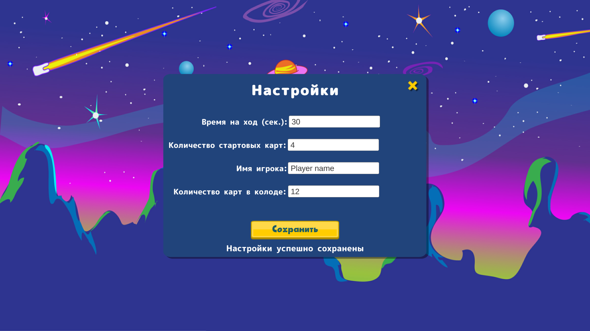

# Game «Clash of Galaxies» on unity C#

Clash of Galaxies is a card strategy in which the player has to use cards represented by various celestial bodies (planets, asteroids, stars, and so on). Each card has a unique behavior with which you can strengthen or attack other cards. To win, the player will have to win more rounds than the opponent.

The project is implemented the MVP-pattern.

## Allows
- Different types of cards
- Drag-and-drop cards
- Enemy player
- Animations
- Menu
- Game settings

## Play the game
Head to the [release page](https://github.com/AlexeyArtem/Clash-of-galaxies/releases) and grab the latest version.
